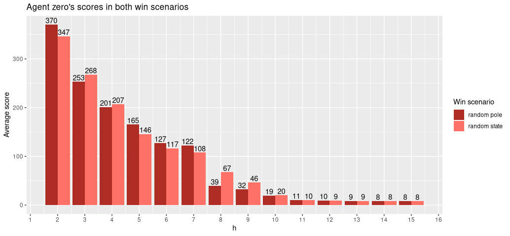
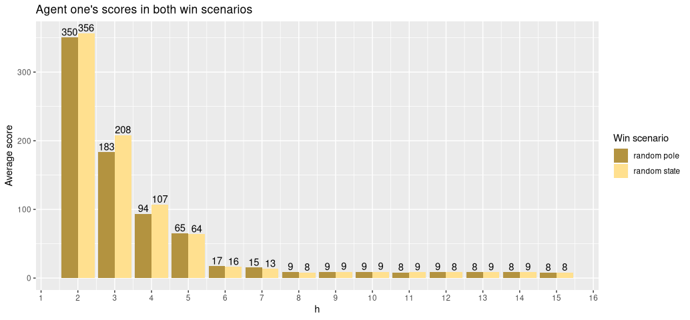
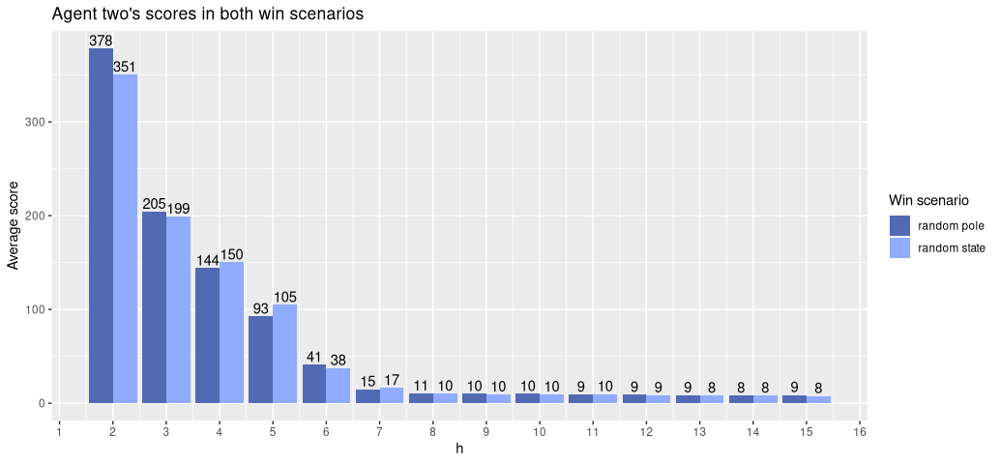
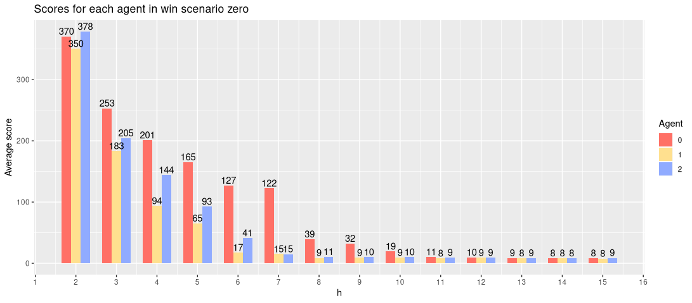
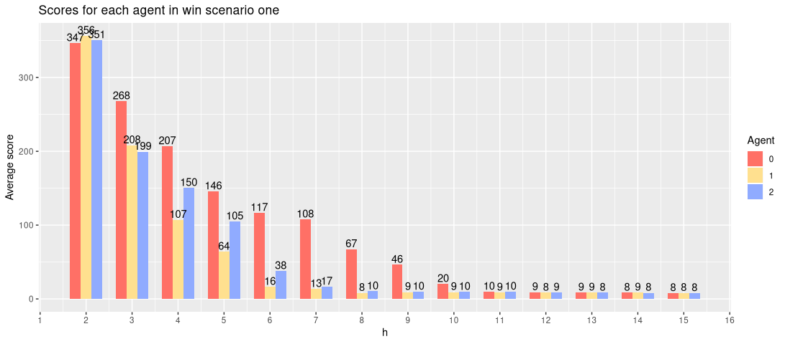

# MP-Hanoi

# Task 1 - Simulation of different play strategies for the Tower of Hanoi Game

For this task three strategies were simulated.
- **Agent 0**: This agent plans h moves ahead and chooses the set of moves that results in the highest score, where the score is measured as the number of discs in the correct location after h moves. When multiple possibilities shared the same score, the agent randomly selected from these.
- **Agent 1**: Given an initial state, this agent identifies the largest misplaced disk. It subsequently plans h moves ahead to try and place this disc in its correct location. If multiple possibilities satisfy this criteria, it chooses from them based on score, analogously to Agent 0. If no possibilities satisfy this criteria, it employs the exact same strategy as agent 0.
- **Agent 2**: This agent is identical to Agent 1, except that it attempts to place a randomly chosen disc.

The Tower of Hanoi game has all discs beginning on the first pole, and the goal is to place them on the final pole. Our simulations differ from the original game in this respect. The start states are randomly initialized. We also experiment with variations on the winning state. In Win Context 0, all discs must be placed on a randomly chosen pole. In Win Context 1, the winning state is randomly chosen. We make no changes to the rules governing disc movements and valable configurations. All simulations involve four discs (the implementation contained here does not elegantly scale to five).

For each agent and win context, we simulate planning horizons in the range of 1 to 15. Each of these individual simulations is performed 250 times and the resulting scores are averaged, where score is the number of turns taken to complete the game. We set a maximum turn limit of 1000, after which a failure is counted.

We now present and discuss the results.

## The Agents

## Win Contexts

# Task 2 - Productivity Scores

For this task, the results of a randomized controlled trial were provided, in which different goal setting apps were provided to participants, from whom productivity scores were subsequently obtained.

Twelve of the columns represent different experiment conditions, and a thirteenth represents the control condition. It is not indicated which column represents the control condition, so it cannot be measured if a given condition produces a significant change with respect to the control.

Given this situation, I have decided to perform a t-test between each column pair. Using the resulting values, I computed an average p-value for a given column with respect to all others. While doing so, I also counted the number of times that the calculated p-value was <= 0.05. The following table contains this information in addition to some other useful metrics.

|condition|   mean|     sd|  av_p|sig_count|
|---------|-------|-------|------|---------|
|X81      | 91.59 | 28.60 | 0.56 |       1 |
|X40      | 92.66 | 27.14 | 0.62 |       0 |
|X99      | 96.20 | 32.97 | 0.57 |       0 |
|X114     | 94.96 | 31.49 | 0.65 |       0 |
|X94      | 94.27 | 29.67 | 0.67 |       0 |
|X116     | 93.62 | 25.01 | 0.65 |       0 |
|X69      | 95.37 | 29.55 | 0.62 |       0 |
|X125     | 90.50 | 28.91 | 0.50 |       1 |
|X84      | 87.00 | 32.72 | 0.34 |       1 |
|X95      |102.05 | 26.79 | 0.18 |       4 |
|X90      | 93.45 | 29.07 | 0.67 |       0 |
|X66      | 94.15 | 32.59 | 0.68 |       0 |
|X74      | 87.76 | 33.70 | 0.39 |       1 |

From the results, we see that the X95 condition stands out. It's average p-value is lowest, and with respect to the X81, X125, X84 and X74 columns, the difference is significant. No other significant differences were found between any other condition pairs.

It can be noted that the mean productivity score of the X95 condition is the highest (102.05), and the standard deviation is the second lowest (26.79). On average, the mean of X95 is 12.84 points higher than the means of the four other columns mentioned above. 

If X95 is the control condition, this is disappointing news for the researchers. In four experiments, the app would have negatively affected productivity, and in the remaining eight no significant difference would have been observed.

If X95 corresponds to one of the app experiments, then the results may be quite promising. It results in significantly better outcomes than at least three other apps. However, it remains unclear whether the results differ from those of the control condition.
